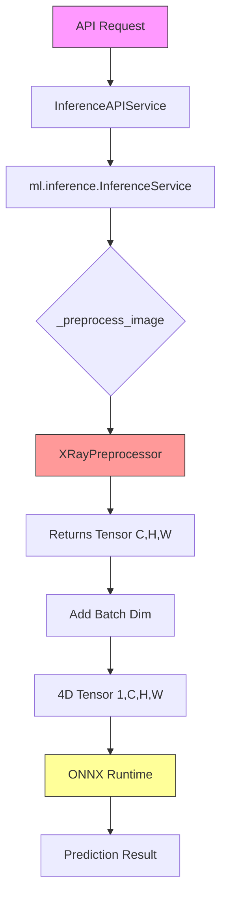

# Codebase Bug Analysis & Fix Plan

## Executive Summary

After evaluating the codebase, I've identified **6 critical bugs** that prevent the application from running correctly with ONNX models.

---

## Bugs Found

### Bug #1: Missing Preprocessor Module (CRITICAL)
**File:** `backend/ml/inference/inference_service.py:12`
```python
from ml.data.preprocessor import XRayPreprocessor
```
**Problem:** The module `ml/data/preprocessor.py` does not exist in the project. This will cause an `ImportError` when the inference service is initialized.

**Impact:** Application crashes on startup.

---

### Bug #2: ONNX Input Shape Mismatch (CRITICAL)
**File:** `backend/ml/inference/inference_service.py:156`
```python
return tensor.numpy()  # Returns shape (C, H, W)
```
**Problem:** ONNX model expects 4D tensor `(batch_size, channels, height, width)`, but preprocessing returns 3D tensor `(channels, height, width)`.

**Impact:** `Invalid rank for input: input_image Got: 3 Expected: 4`

---

### Bug #3: Albumentations API Deprecation (WARNING)
**File:** `backend/ml/data/preprocessor.py:33` (if exists)
```python
A.GaussNoise(var_limit=(10, 50), p=0.2),
```
**Problem:** `var_limit` parameter is deprecated in newer Albumentations versions. Should use `var_limit_x` and `var_limit_y`.

**Impact:** UserWarning about invalid argument.

---

### Bug #4: CUDA Provider Warning (WARNING)
**File:** `backend/ml/inference/inference_service.py:104`
```python
providers=['CUDAExecutionProvider', 'CPUExecutionProvider']
```
**Problem:** CUDA is not available on the system, causing warning messages. Not a crash but noisy.

**Impact:** Warning messages in logs.

---

### Bug #5: Model Path Resolution (POTENTIAL)
**File:** `backend/app/core/config.py:15-16`
```python
CNN_MODEL_PATH: str = "./models/cnn_best.onnx"
VIT_MODEL_PATH: str = "./models/vit_best.onnx"
```
**Problem:** Relative paths may not resolve correctly depending on working directory.

**Impact:** Models not found even when they exist.

---

### Bug #6: FALLBACK_MODE Default (CONFIG)
**File:** `backend/app/core/config.py:25`
```python
FALLBACK_MODE: bool = os.getenv("FALLBACK_MODE", "true").lower() == "true"
```
**Problem:** Default is `true`, so models won't be loaded unless explicitly set to `false`.

**Impact:** App runs in fallback mode by default even with ONNX models available.

---

## Fix Plan

### Phase 1: Create Missing Preprocessor (Priority: HIGH)
- [ ] Create `backend/ml/data/preprocessor.py` with `XRayPreprocessor` class
- [ ] Implement `preprocess_single()` method returning torch.Tensor with shape `(C, H, W)`

### Phase 2: Fix ONNX Input Shape (Priority: HIGH)
- [ ] Modify `_preprocess_image()` in `inference_service.py`:
  ```python
  def _preprocess_image(self, image: np.ndarray) -> np.ndarray:
      tensor = self.preprocessor.preprocess_single(image, is_training=False)
      # Add batch dimension (1, C, H, W)
      return np.expand_dims(tensor.numpy(), axis=0)
  ```

### Phase 3: Fix Albumentations API (Priority: MEDIUM)
- [ ] Update `GaussNoise` parameters to use `var_limit_x` and `var_limit_y`

### Phase 4: Fix CUDA Provider (Priority: LOW)
- [ ] Change provider order or remove CUDA from providers:
  ```python
  providers=['CPUExecutionProvider']  # Skip CUDA if not available
  ```
- [ ] Or add graceful warning suppression

### Phase 5: Fix FALLBACK_MODE Default (Priority: MEDIUM)
- [ ] Change default to `"false"` in config:
  ```python
  FALLBACK_MODE: bool = os.getenv("FALLBACK_MODE", "false").lower() == "true"
  ```

---

## Architecture Diagram



---

## Testing Checklist

After fixes, verify:
- [ ] App starts without ImportError
- [ ] ONNX inference works with single image
- [ ] No "Invalid rank" errors
- [ ] Batch inference works
- [ ] Fallback mode can be toggled
- [ ] No CUDA warnings (or gracefully handled)
