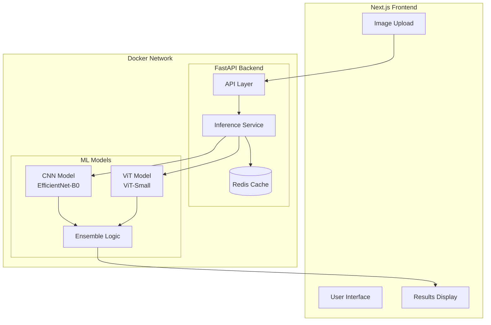

# MVP Implementation Plan: COVID-19 vs Pneumonia Classifier

## Project Overview
This plan outlines the creation of a fully working MVP (Minimum Viable Product) for a COVID-19 vs Pneumonia classification system using a hybrid CNN-Transformer architecture.

## Current State Analysis

### Backend (FastAPI) - Existing ✅
- Main API application with CORS middleware
- Health check endpoint at `/api/v1/health`
- Prediction endpoints at `/api/v1/predict/single` and `/api/v1/predict/batch`
- InferenceAPIService wrapper
- ONNX inference service (requires ONNX models)
- Configuration system

### ML Components - Existing ✅
- EfficientCNN model (EfficientNet-B0 backbone)
- MedicalViT model (ViT-Small backbone)
- Hybrid system with two-stage inference
- Preprocessor for X-ray images
- ONNX export scripts

### Missing Components ⚠️
- ONNX model files (`cnn_best.onnx`, `vit_best.onnx`) - **Need to train**
- Next.js 16 frontend
- Docker configuration
- Trained model weights

---

## Architecture Diagram



---

## Updated Implementation Phases

### Phase 1: Backend - Make Redis Optional & Fix Inference

**Objective**: Ensure API works without Redis and create fallback for missing models

**Tasks**:
1. Modify InferenceService to handle Redis connection failures gracefully
2. Add fallback mode when Redis is unavailable
3. Create dummy/fallback inference when ONNX models are not available
4. Update config to make Redis optional

**Files to modify**:
- `backend/ml/inference/inference_service.py`
- `backend/app/core/config.py`

---

### Phase 2: Dataset - Download from Kaggle & Prepare

**Objective**: Download COVID-19 and Pneumonia X-ray dataset

**Tasks**:
1. Install kaggle CLI: `pip install kaggle`
2. Configure Kaggle API credentials
3. Download dataset (COVID-19 Radiography Database or similar)
4. Explore and organize dataset structure
5. Preprocess images if needed

**Commands**:
```bash
# Download dataset from Kaggle
kaggle datasets download -d tawsifurrahman/covid19-radiography-database
unzip covid19-radiography-database.zip
```

**Dataset Structure Expected**:
```
data/
├── COVID/
├── Normal/
└── Pneumonia/
```

---

### Phase 3: ML Training - Train CNN and ViT Models

**Objective**: Train the hybrid CNN-Transformer models

**Tasks**:
1. Create training script with:
   - Data loading and augmentation
   - EfficientCNN training
   - MedicalViT training
   - Model checkpointing
2. Train EfficientCNN model
3. Train MedicalViT model
4. Export trained models to ONNX format

**Files to create**:
- `backend/ml/training/train_cnn.py`
- `backend/ml/training/train_vit.py`
- `backend/ml/training/train_hybrid.py`

---

### Phase 4: Backend - Generate ONNX Models

**Objective**: Export trained models to ONNX format

**Tasks**:
1. Load trained PyTorch checkpoints
2. Export CNN model to ONNX
3. Export ViT model to ONNX
4. Place ONNX models in `backend/models/` directory
5. Update config to point to correct model paths

---

### Phase 5: Frontend - Next.js 16 Setup

**Objective**: Set up Next.js 16 project in separate folder

**Tasks**:
1. Create Next.js app: `npx create-next-app@latest frontend`
2. Configure Next.js 16 with TypeScript (optional)
3. Install dependencies: axios, tailwindcss
4. Set up project structure:
   - `frontend/app/` - App router pages
   - `frontend/components/` - UI components
   - `frontend/lib/` - API services
5. Configure environment variables for API URL

**Folder Structure**:
```
frontend/
├── app/
│   ├── page.tsx
│   ├── layout.tsx
│   └── api/
├── components/
│   ├── ImageUploader.tsx
│   ├── PredictionResult.tsx
│   └── Navbar.tsx
├── lib/
│   └── api.ts
├── public/
└── package.json
```

---

### Phase 6: Frontend - Image Upload Component

**Objective**: Create component for uploading X-ray images

**Tasks**:
1. Create `ImageUploader` component with:
   - Drag-and-drop functionality
   - File type validation (JPG, PNG, JPEG)
   - Image preview
   - Loading states
2. Add to main page

---

### Phase 7: Frontend - Prediction Display Component

**Objective**: Create component to display classification results

**Tasks**:
1. Create `PredictionResult` component with:
   - Predicted class (COVID-19, Pneumonia, Normal)
   - Confidence score visualization
   - Probability distribution chart
   - Model used indicator (CNN/Hybrid)

---

### Phase 8: Frontend - Connect to Backend

**Objective**: Integrate frontend with FastAPI backend

**Tasks**:
1. Create API service module
2. Implement POST request to `/api/v1/predict/single`
3. Handle response and errors
4. Add loading states
5. Configure CORS in backend

---

### Phase 9: Docker - Containerize Application

**Objective**: Add Docker support for easier deployment

**Tasks**:
1. Create `backend/Dockerfile`:
   - Python base image
   - Install dependencies
   - Copy backend files
   - Expose port 8000
   
2. Create `frontend/Dockerfile`:
   - Node.js base image
   - Build Next.js app
   - Serve with nginx or standalone
   
3. Create `docker-compose.yml`:
   - Backend service
   - Frontend service
   - Redis service (optional)
   - Network configuration

4. Create `.dockerignore` files

**Docker Compose Services**:
- `backend` - FastAPI application
- `frontend` - Next.js application  
- `redis` - Caching layer (optional)

---

### Phase 10: Integration & Testing

**Objective**: Verify full application works

**Tasks**:
1. Build Docker images
2. Start containers with docker-compose
3. Test health endpoint
4. Upload sample X-ray image
5. Verify prediction results
6. Test full flow end-to-end

---

## Running the MVP

### Option 1: Without Docker

**Backend**:
```bash
cd backend
source venv/bin/activate
python3 run.py
# API: http://localhost:8000
# Docs: http://localhost:8000/docs
```

**Frontend**:
```bash
cd frontend
npm install
npm run dev
# Frontend: http://localhost:3000
```

### Option 2: With Docker

```bash
# Build and start all services
docker-compose up --build

# Or run in detached mode
docker-compose up -d
```

---

## Success Criteria

1. ✅ Backend API starts without errors
2. ✅ Health endpoint returns healthy status
3. ✅ Models are trained on Kaggle dataset
4. ✅ ONNX models are generated from trained weights
5. ✅ Prediction endpoint accepts image and returns results
6. ✅ Next.js 16 frontend loads and displays properly
7. ✅ User can upload X-ray image and see prediction
8. ✅ Docker containers build and run successfully
9. ✅ Full flow works end-to-end

---

## Notes

- The project uses a hybrid CNN-Transformer architecture
- Two-stage inference: CNN first, then ViT for uncertain predictions
- Redis caching is optional but improves performance
- Next.js 16 uses App Router by default
- Docker Compose simplifies multi-container deployment
